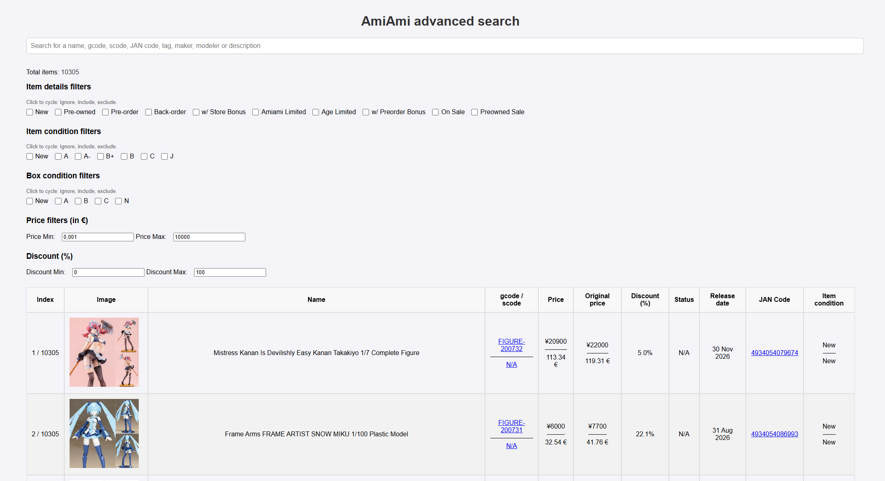

# AmiAmi scraper

Scraping process for the website AmiAmi.

Created to ease the browsing experience in AmiAmi, this repo contains the scraping part to retrieve wanted tags or categories from the website, as well as a basic webpage, that will read scraped data and allow more precise search in it.



Supported filters:
- Query search on name, gcode/scode, JAN code, tags, maker, modeler and description
- Name, gcode, price, release date and item condition sorting
- Advanced item status (?) filtering (whether the item is pre-owned, a pre-order, new...)
- Advanced item and box condition filtering
- Advanced price filtering (min and max borders) on the EURO value

## Dependencies

- Python 3.10 (untested on other versions)
- Pydantic (for data models)
- curl-cffi (for for requesting urls while impersonating browsers)

Dependencies management is done using [uv](https://github.com/astral-sh/uv). You can create the same virtual environment using the following commands in the root directory (after installing `uv`):
```sh
uv venv --python 3.10
.venv/Scripts/activate              # Windows
source .venv/Scripts/activate       # Linux / MacOS
uv pip install -r pyproject.toml
```

> Note: If not already installed, you can also download Python 3.10 using `uv` with the following command:
```sh
uv python install 3.10
```

## Windows quick start

These scripts keep the project on a local Python `3.10` environment in `.venv` and do not run the app on your system Python `3.14`. They also keep `uv` cache and managed Python files inside the repo.

1. Run the setup script:
```powershell
powershell -ExecutionPolicy Bypass -File .\scripts\setup.ps1
```
2. Refresh the available AmiAmi scrape options:
```powershell
powershell -ExecutionPolicy Bypass -File .\scripts\run-discover-options.ps1
```
3. Start the scraper:
```powershell
powershell -ExecutionPolicy Bypass -File .\scripts\run-scraper.ps1
```
4. Start the web UI in another terminal:
```powershell
powershell -ExecutionPolicy Bypass -File .\scripts\run-web.ps1
```
5. Open [http://127.0.0.1:8000/web/index.html](http://127.0.0.1:8000/web/index.html)

To remap only the latest raw file from `output` without rerunning scraping:
```powershell
powershell -ExecutionPolicy Bypass -File .\scripts\run-enrich-latest.ps1
```

To build one self-contained HTML file from the latest mapped dataset:
```powershell
powershell -ExecutionPolicy Bypass -File .\scripts\export-standalone-latest.ps1
```

For users who prefer double-click launchers, the same actions are available as `.bat` files in [user_scripts](C:\Users\penky\Documents\GitHub\scraper-amiami\user_scripts):
- `setup.bat`
- `run-scraper.bat`
- `run-web.bat`
- `run-enrich-latest.bat`
- `export-standalone-latest.bat`

The setup script will install `uv` automatically if it is missing, then create `.env` from `.env.default` and build the local Python `3.10` environment.
The scraper now defaults to a browser-backed flow using your locally installed Chrome so it can attempt to pass AmiAmi's Cloudflare checks.
If you want the old direct HTTP mode, set `AMIAMI_TRANSPORT = "direct"` in `.env`.
Before an interactive scrape session, `run-discover-options.ps1` can refresh the currently available AmiAmi category and type choices and sync them into `.env`, `.env.default`, and `output/amiami-discovery.json`.

## Config

### 1. .env file

This project uses a `.env` file to centralize project variables. Currently, you don't need to add any credentials to run the project, so you only have to copy and rename the `.env.default` file to `.env`.

> Note: You can also change there the number of items crawled per page, with the *ITEMS_PER_PAGE* variable.
>
> Browser-backed scraping options:
> - `AMIAMI_TRANSPORT = "browser"` uses Chrome through Playwright
> - `AMIAMI_BROWSER_CHANNEL = "chrome"` picks the installed browser channel
> - `AMIAMI_HEADLESS = "false"` keeps the browser visible, which helps if Cloudflare asks for verification
> - `AMIAMI_CRAWL_SLEEP_SECONDS` controls delay between `/items` page requests
> - `AMIAMI_DETAIL_SLEEP_SECONDS` controls delay between `/item` detail requests
> - `AMIAMI_FETCH_PREOWNED_DETAILS = "false"` skips slow per-item pre-owned detail enrichment for faster results
> - `AMIAMI_PAGE_WORKERS` controls how many `/items` pages are fetched in parallel
> - `AMIAMI_DETAIL_WORKERS` controls how many `/item` detail requests are fetched in parallel during enrichment
> - `AMIAMI_MAX_RETRIES` controls how many times a request is retried after `429`
> - `AMIAMI_RETRY_BASE_SECONDS` controls the exponential backoff base delay after `429`
> - `AMIAMI_ENRICH_SAVE_EVERY` controls how often the mapped JSON checkpoint is rewritten during enrichment

For scraper batch selection, the `.env` file now also stores:
- current scrape settings:
  - `AMIAMI_SCRAPE_KEYWORD`
  - `AMIAMI_SCRAPE_NUM_PAGES`
  - `AMIAMI_SCRAPE_TYPES`
  - `AMIAMI_SCRAPE_CATEGORY1`
  - `AMIAMI_SCRAPE_CATEGORY2`
  - `AMIAMI_SCRAPE_CATEGORY3`
  - `AMIAMI_SCRAPE_SORT_KEY`
- currently available choices for the interactive prompt:
  - `AMIAMI_AVAILABLE_SCRAPE_TYPES`
  - `AMIAMI_AVAILABLE_SCRAPE_CATEGORY1`
  - `AMIAMI_AVAILABLE_SCRAPE_CATEGORY2`
  - `AMIAMI_AVAILABLE_SCRAPE_CATEGORY3`
  - `AMIAMI_AVAILABLE_SCRAPE_SORT_KEY`

Running `scripts/run-discover-options.ps1` refreshes those available values from AmiAmi when possible and also updates the human-readable `# Available values:` blocks in both `.env` and `.env.default`.


## Architecture

There are 3 main directories in this project:
- `core`, which contains the scraping process (Python)
- `web`, which contains the webview (HTML/CSS/JS + JSON files)
- `output`, which contains the raw API dumps (created when running the script, mostly JSON files)


## Usage

### 1. Scraping

The main entry point is [core/main.py](C:\Users\penky\Documents\GitHub\scraper-amiami\core\main.py).
The recommended way to run it on Windows is still:
```powershell
powershell -ExecutionPolicy Bypass -File .\scripts\run-scraper.ps1
```

The recommended setup before a scrape run is:
```powershell
powershell -ExecutionPolicy Bypass -File .\scripts\run-discover-options.ps1
powershell -ExecutionPolicy Bypass -File .\scripts\run-scraper.ps1
```

`run-scraper.ps1` now works interactively:
- it shows the current scraper settings from `.env`
- it asks whether to keep them or edit them
- if you choose to edit them, it lets you select types, categories, and sort mode from numbered console lists
- any changes are saved back into `.env` and become the new defaults for the next run

If you want to run the Python entry point directly with `uv`, use:
```sh
uv run --python 3.10 --env-file=.env core/main.py
```

The current [core/main.py](C:\Users\penky\Documents\GitHub\scraper-amiami\core\main.py) reads one scraper batch from `.env`, not from a hardcoded `batch_args` block. By default, that batch is:
- `AMIAMI_SCRAPE_CATEGORY2 = "BISHOUJO_FIGURES"`
- `AMIAMI_SCRAPE_TYPES = "BACK_ORDER,NEW,PRE_ORDER,PRE_OWNED"`
- `AMIAMI_SCRAPE_SORT_KEY = "RECENT_UPDATE"`

If you want to change what gets scraped, the normal workflow is no longer "edit `main.py` manually". Instead:
1. refresh available options with `run-discover-options.ps1`
2. run `run-scraper.ps1`
3. choose new values interactively in the console

You can still run `core/main.py` directly with `uv`; it will use whatever values are currently stored in `.env`.

Each batch generates:
- one raw dump in `output`
- one mapped/enriched dataset in `web/data`

If you already have a raw dump and only want to rerun the mapping/enrichment phase, use:
```powershell
powershell -ExecutionPolicy Bypass -File .\scripts\run-enrich-latest.ps1
```

Displaying and real-time filtering can then be done using the webview.


### 2. Web view

The webview is very basic (plain HTML/CSS/JS), but sufficient to browse one or more potential large JSON files of scraped data.
But because the JavaScript must read local files, you need to start a local server to bypass CORS restrictions.

You can use the following command in the root directory:
```sh
uv run --python 3.10 python -m http.server 8000
```
and then access the page at [localhost:8000/web/index.html](localhost:8000/web/index.html).

The JSON files read must be located in the `web/data` directory, as well as be referenced in the `data/_data_files.txt` file.
This file will be read in the JavaScript to load all listed files.

That way, you can initiate various scrapings and display all the data in the same place. Alternatively, you can hide some results by removing their names in the listing file.

Filters were listed at the beginning and are pretty straightforward.

## Known issue

As of April 3, 2026, AmiAmi is returning a Cloudflare challenge page (`HTTP 403`) to direct API requests. The scraper now uses a browser-backed flow by default and may open Chrome for you to complete a verification step before continuing.


## Credits

Thanks to relhamdi's [repo](https://github.com/relhamdi/scraper-amiami) for the original project of this scrapper
Thanks to marvinody's [repo](https://github.com/marvinody/amiami) for giving me the idea to use curl-cffi.


## TODO

- Add support to more AmiAmi categories (s_cate_tag)
- Improve logging
- Differentiate a new item and an item with no item_condition extracted (currently both at "")
- More advanced search bar (exclusion, coma separated searches...)
- Remove duplicates items in webview if any
- Add support for `min_price` and ` max_price`
- Prune alt items from pre-owned to keep only one (the best quality)
